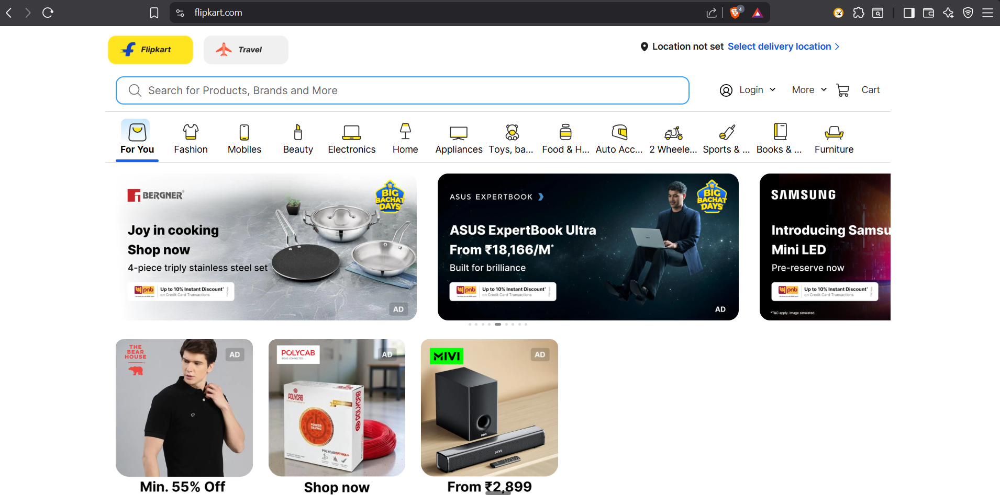
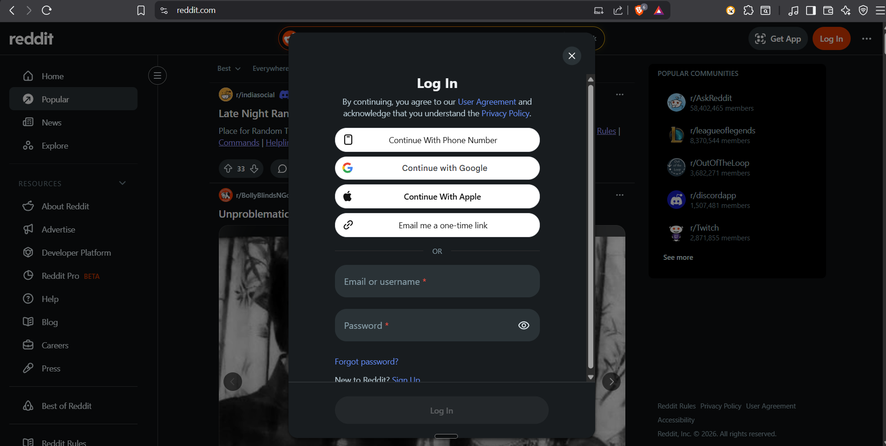

# PostQode Exploration Artifacts

This repository contains UI exploration outputs, test cases, screenshots, and Playwright automation scripts created during previous tasks.

## What is included

- **Screenshots** captured from explored web pages
- **Test case documents** written for each captured page
- **Playwright scripts** for automated validation
- A small Node.js + Playwright setup for running browser-based checks

## Project structure

```text
screenshots/
testcases/
playwright-tests/
```

### Screenshots

| Screenshot | Description | Related Test Case Document |
|---|---|---|
| `screenshots/Flipkart_HomePage.png` | Flipkart home page exploration screenshot | `testcases/Flipkart_HomePage_TestCases.md` |
| `screenshots/Reddit_LoginPage.png` | Reddit login page exploration screenshot | `testcases/Reddit_LoginPage_Critical_Functional_Scenarios.md` |

## Screenshot previews

### Flipkart Home Page



Related test cases:
- `testcases/Flipkart_HomePage_TestCases.md`

### Reddit Login Page



Related test cases:
- `testcases/Reddit_LoginPage_Critical_Functional_Scenarios.md`

## Test case documents

### Flipkart Home Page
File: `testcases/Flipkart_HomePage_TestCases.md`

Covers:
- Homepage load verification
- Search bar validation
- Category navigation
- Empty search handling
- Invalid search handling
- Slow network / partial load behavior

### Reddit Login Page
File: `testcases/Reddit_LoginPage_Critical_Functional_Scenarios.md`

Covers:
- Critical login page functional scenarios
- Page load / form behavior
- Authentication-related edge cases

## Playwright scripts

The repository currently includes a Playwright spec for Flipkart:

- `playwright-tests/flipkart-homepage/flipkart-homepage.spec.js`

### What the Flipkart Playwright script does

It validates:

- Flipkart home page loads successfully
- Search bar accepts valid input
- Popup handling on landing page
- Basic visibility checks for homepage elements

### Test cases implemented in the script

- `TC_POS_01` - Verify the Flipkart home page loads successfully
- `TC_POS_02` - Verify the search bar accepts valid product input

## Flipkart Playwright example

```javascript
const { test, expect } = require('@playwright/test');

test.describe('Flipkart Home Page', () => {
  const homePageUrl = 'https://www.flipkart.com/';

  async function openFlipkartHome(page) {
    await page.goto(homePageUrl, { waitUntil: 'domcontentloaded' });

    // Flipkart often shows a login popup on landing; close it if present.
    const closeButton = page.locator('button:has-text("✕"), button:has-text("×"), button[aria-label="Close"]');

    if (await closeButton.first().isVisible({ timeout: 3000 }).catch(() => false)) {
      await closeButton.first().click({ force: true }).catch(() => {});
    }

    await page.waitForLoadState('networkidle').catch(() => {});

    // Ensure any remaining modal overlay is gone before assertions.
    await closeButton.first().waitFor({ state: 'detached', timeout: 3000 }).catch(() => {});
  }

  test('TC_POS_01 - Verify the Flipkart home page loads successfully', async ({ page }) => {
    await openFlipkartHome(page);

    const searchBar = page.getByRole('textbox', { name: /search for products, brands and more/i });
    const loginMenu = page.getByRole('link', { name: 'Login' }).first();
    const categoryNav = page
      .getByRole('link')
      .filter({ hasText: /Mobiles|Electronics|Fashion|Home|Appliances|Beauty|2 Wheelers|Two Wheelers/i })
      .first();
    const featuredBanner = page.getByRole('heading', { name: /what can you buy from flipkart\?/i });

    await expect(searchBar).toBeVisible();
    await expect(loginMenu).toBeVisible();
    await expect(categoryNav).toBeVisible();
    await expect(featuredBanner).toBeVisible();
  });

  test('TC_POS_02 - Verify the search bar accepts valid product input', async ({ page }) => {
    await openFlipkartHome(page);

    const searchBar = page.getByRole('textbox', { name: /search for products, brands and more/i });

    await expect(searchBar).toBeVisible();
    await searchBar.click();
    await searchBar.fill('mobile');
    await expect(searchBar).toHaveValue('mobile');

    await searchBar.press('Enter');

    await page.waitForLoadState('networkidle').catch(() => {});

    const suggestions = page.locator('[role="listbox"], [role="option"], text=/mobile/i');
    await expect(suggestions.first()).toBeVisible({ timeout: 10000 }).catch(async () => {
      await expect(page.getByRole('textbox', { name: /search for products, brands and more/i })).toHaveValue('mobile');
    });
  });
});
```

## How to run Playwright tests

1. Install dependencies:

```bash
npm install
```

2. Run the Flipkart spec:

```bash
npx playwright test playwright-tests/flipkart-homepage/flipkart-homepage.spec.js
```

3. Run all Playwright tests:

```bash
npx playwright test
```

## Notes

- The screenshots and test case documents were created from previous UI exploration tasks.
- The Flipkart script is written in CommonJS format to match the current Node.js project setup.
- The repository currently uses `@playwright/test` as a dev dependency.

## Quick reference

- Screenshots: `screenshots/`
- Test cases: `testcases/`
- Playwright scripts: `playwright-tests/`
- Main Flipkart spec: `playwright-tests/flipkart-homepage/flipkart-homepage.spec.js`
